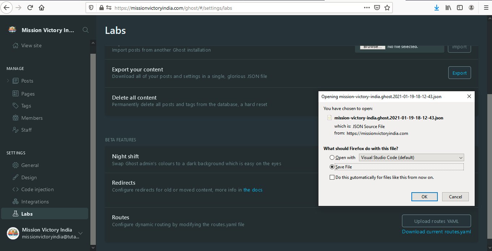
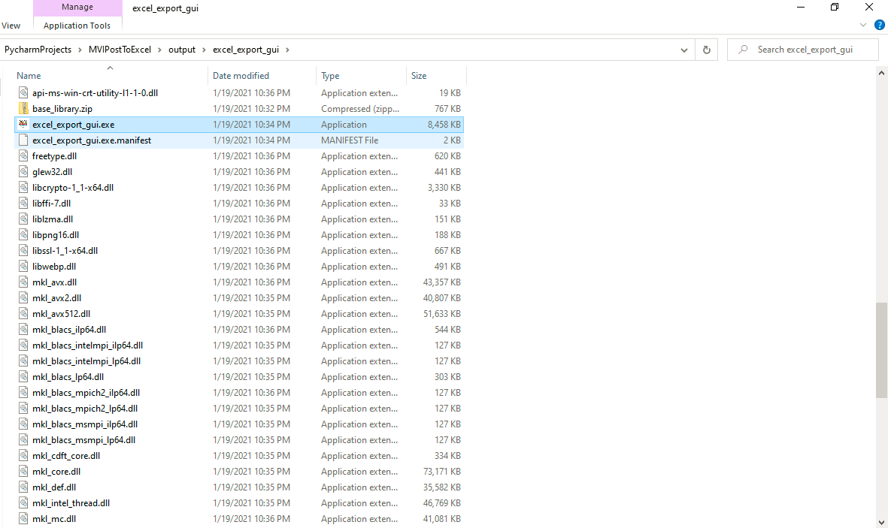

# ghost-export-utility
An Excel Export Utility to Convert JSON export from Ghost CMS to a neat Excel

## Objective
To create an Excel Export of our posts with Author Names, Link to the Article, Link to the Online Editor to make updates, etc.

## Steps
1. Log into https://missionvictoryindia.com/ghost with the admin credentials

2. Navigate to "Labs" from the left side panel and under "Export your content" click on "Export". This will download a file as shown in the screenshot below

3. Save this file to appropriate location. Now, download the utility from the link shared above. Unzip the folder and navigate to "excel_export_gui.zip\excel_export_gui". There you will find "excel_export_gui.exe". Click on it to run the utility as shown below

4. After executing the file, you will see the utility as below

5. Click on "Upload JSON" to select the file we had downloaded in Step 2. Click on "Select Output Directory" to select the folder where you want to see the Excel after the operation. After this, click on "Export". If everything goes alright, you should see the following in the application

6. Navigate to the selected output directory and you should see the excel export

7. Open the Excel Export to find the required details

## Usage/Installation
For the convenience of not so tech savvy people, we have produced an exe for Windows users using auto-py-to-exe. You can find this under release. Otherwise, you can also run it directly in your Python environment of choice.

## Future Work
- Revamp UI. It is neither our forte nor requirement to have a good looking UI, but good looks do not hurt when it comes to GUI applications.
- Connect to Ghost API. Right now, the process is still very manual. Ideally, we should be able to add the API token and the Ghost instance URI to directly generate the excel. Again, this is not our requirement for now. However, this is what the project should be.